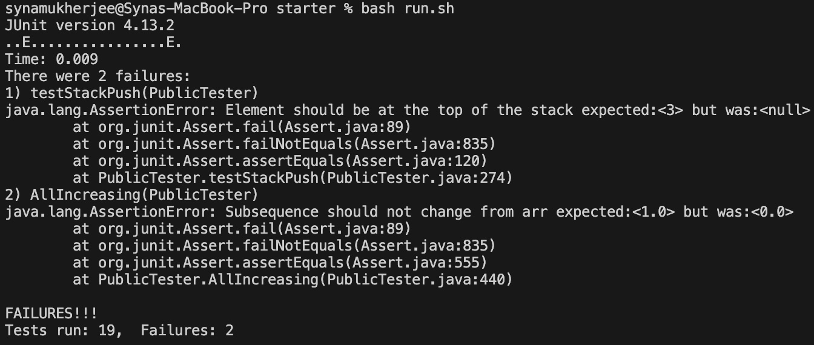
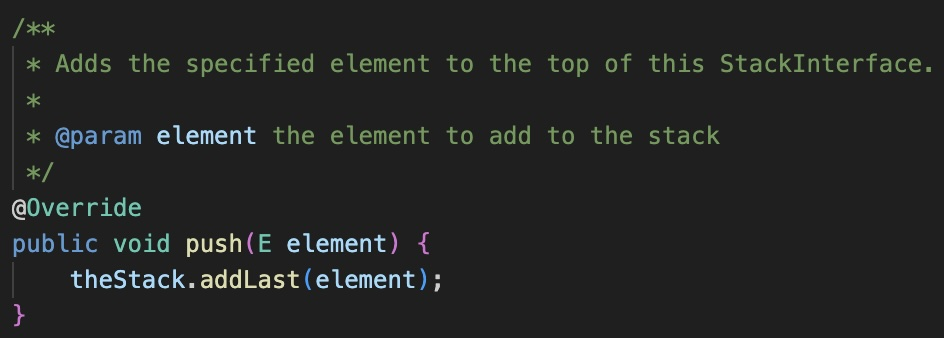
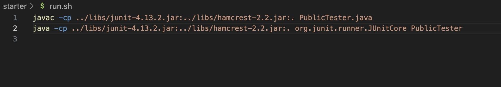
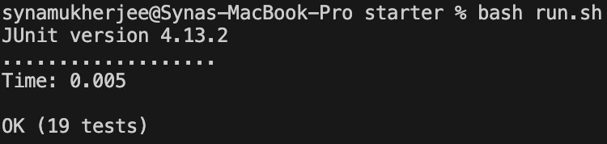

# Lab Report 5 (Week 9)

## **Part 1 – Debugging Scenario**

---

**Original Post from Student:**

Hey,

I'm working on this Java assignment that's supposed to make a stack. For some reason my push function isn't working. I've attached a screenshot of the output below. Any ideas on what might be causing this?

---

**Response from TA:**

Hey there,

Thanks for reaching out. Could you share the code snippet and the bash script?

---

**Student's Follow-Up:**

Sure thing! Here's the code snippet:

**Follow-up from TA:**

I see the problem. Could you try changing `addLast` to `addFirst`? That should make it work.

**Student's Follow-Up:**

Thanks it worked!

## **Part 2 - Reflection**

I learned how to make my task of running multiple commands easier using bash scripts. It has saved me a lot of time in running my tests for CSE 12 assignments.
